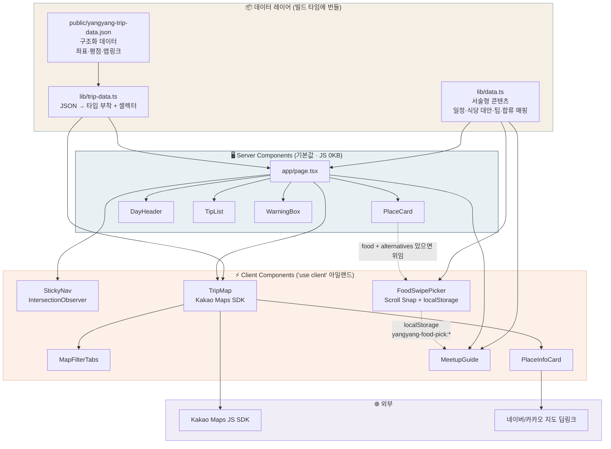
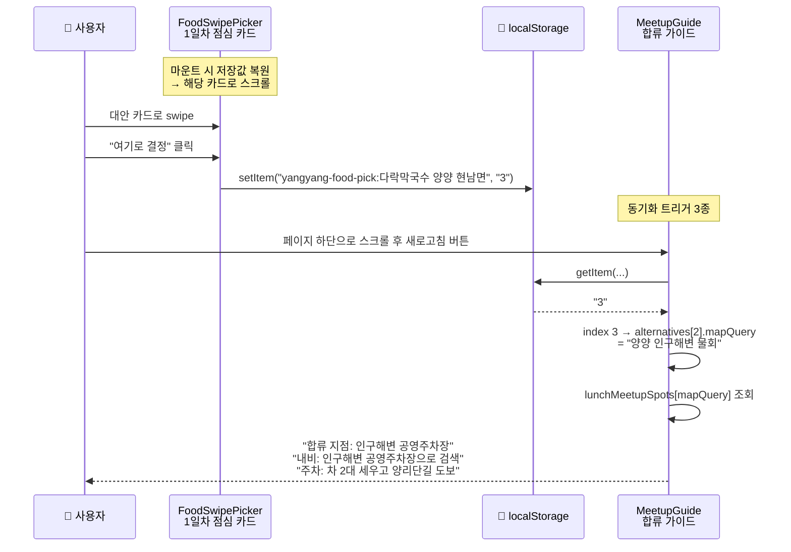
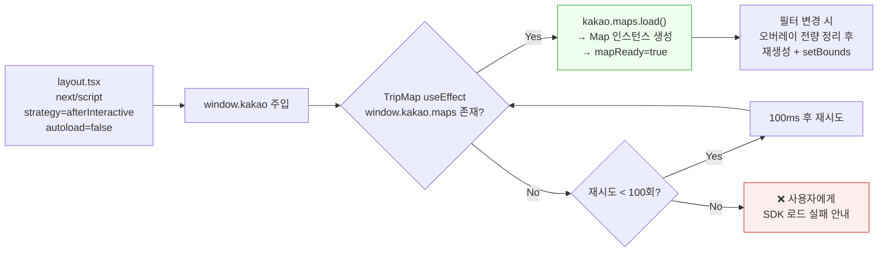

# 🌊 양양 2박 3일 — 태교 힐링 여행

> 임산부·영유아 동반 가족 여행을 위해 만든 **모바일 우선 여행 일정 안내 웹앱**
> Next.js 16 (App Router) · React 19 · TypeScript · Tailwind CSS v4 · Kakao Maps SDK

<p align="center">
  
</p>

---

## 📖 프로젝트 소개

가족 6명(처남네 3명 + 우리집 3명, **임산부 1명 · 3세 아이 · 9개월 아기 포함**)이 떠나는
2026년 6월 6일~8일 강원도 양양 여행의 일정·동선·식당·비상 대안을
**단톡방 링크 하나로 공유**하기 위해 만든 사이트입니다.

기존의 "카톡에 일정표 텍스트 복붙" 방식은 이런 문제가 있었습니다.

| 기존 방식의 문제 | 이 프로젝트의 해결 |
| --- | --- |
| 스크롤을 한참 올려야 일정을 찾음 | Sticky 탭 내비 + 스크롤 스파이로 현재 위치 항상 표시 |
| 식당 이름만 있고 위치를 모름 | 카카오맵 인터랙티브 지도 + 네이버/카카오 딥링크 버튼 |
| "여기 말고 다른 데 없어?" 라는 질문 반복 | 식사마다 **대안 3곳을 swipe로 비교·선택** |
| 점심 장소가 바뀌면 합류 지점 안내가 무용지물 | 선택 결과가 **합류·내비·주차 가이드에 자동 반영** |
| 임산부가 갈 수 있는 곳인지 판단 불가 | 장소마다 **임산부 친화도 · 경사/계단 정보** 명시 |

> 💡 컨셉의 핵심은 "확정된 일정표"가 아니라 **"컨디션에 따라 갈아끼울 수 있는 선택지 카탈로그"** 입니다.
> 그래서 데이터 모델도 `Place` 하나가 아니라 `Place + alternatives[]` 구조로 설계했습니다.

---

## ✨ 주요 기능

### 1. 🗺 카카오맵 기반 여행 동선 지도

<sub>`app/components/TripMap.tsx` · `MapFilterTabs.tsx` · `PlaceInfoCard.tsx`</sub>

- **일정 장소 10곳 + 추천 카페 5곳**의 실좌표를 커스텀 오버레이 핀으로 렌더링
- `전체 / 1일차 / 2일차 / 3일차 / 추천 카페` **5종 필터** — 필터를 바꾸면 해당 핀만 남기고 `map.setBounds()`로 자동 줌 피팅
- 핀 색상이 곧 범례 — 1일차 `#8AA6A3`, 2일차 `#3D5A6C`, 3일차 `#E8B298`, 카페 `#A78BFA`
- 핀 안의 이모지는 카테고리(🍽 식사 / ☕ 카페 / 📍 명소 / 🚶 산책 / 🏨 숙소)를 즉시 구분
- 핀 클릭 → 지도 하단에 **상세 카드**가 열림 (영업시간, 도착 예정 시각/체류 시간, 평점·리뷰 수, 임산부 추천 포인트, 참고 블로그 후기)
- **"카카오맵에서 열기"** 버튼은 모바일이면 `kakaomap://look?p=lat,lng` 앱 스킴을 먼저 시도하고, 1.5초 안에 앱이 안 뜨면 웹 지도로 폴백

### 2. 🍽 식사 후보 Swipe 선택기

<sub>`app/components/FoodSwipePicker.tsx`</sub>

이 프로젝트에서 가장 공을 들인 인터랙션입니다.

- 식사 일정(1일차 점심·저녁, 2일차 점심·저녁)마다 **기본 1곳 + 대안 3곳 = 총 4장의 카드**를 가로 스와이프로 비교
- CSS Scroll Snap (`snap-x snap-mandatory`) 기반이라 **JS 제스처 라이브러리 없이** 네이티브한 스와이프 감각
- 대안은 성격이 겹치지 않게 큐레이션 — 예: 1일차 점심 = 막국수(기본) / 넓은 좌석 막국수 / 아이 친화 양식 / 🐟 시원한 물회
- 카드마다 지도·전화·공식 사이트·예약 링크 버튼을 조건부 렌더링
- **"여기로 결정"** 버튼 → 선택이 `localStorage`에 저장되어 **새로고침·재방문에도 유지**
- 데스크톱 좌우 화살표 + 하단 도트 인디케이터, 스크롤 위치로부터 활성 인덱스를 역산

### 3. 🚗 선택에 반응하는 합류 & 출발 가이드

<sub>`app/components/MeetupGuide.tsx`</sub>

차 2대가 서로 다른 도시(월계 / 망포)에서 출발해 양양에서 만나는 상황을 위한 기능입니다.

- 1일차 12:30 점심 식당을 무엇으로 골랐는지 `localStorage`에서 읽어와
  **합류 지점 · 내비 안내 · 주차/입장 팁**을 그 식당에 맞는 내용으로 교체
- 선택 이력이 없으면 `lunchMeetupFallback`으로 안전하게 폴백
- 동기화 경로 3가지 — ① 다른 탭 변경 감지 `storage` 이벤트, ② 탭 복귀 시 `focus` 이벤트, ③ 수동 새로고침 버튼
  (같은 탭 내 변경은 `storage` 이벤트가 발생하지 않는 브라우저 사양 때문에 ②·③을 함께 둠)
- 서버 렌더링 결과와 클라이언트 값이 어긋나지 않도록 `hydrated` 플래그로 **hydration mismatch를 방지**

### 4. 📍 일자별 타임라인 & 상세 카드

<sub>`app/components/PlaceCard.tsx` · `DayHeader.tsx`</sub>

- 1~3일차를 시간 순 카드로 배치 — 도착 시각, 체류 시간, 주소, 영업시간, 설명
- `category`(`food` / `place` / `walk` / `lodging`)에 따라 아이콘·배지 색이 자동 결정
- **`PlaceCard`는 라우팅 컴포넌트 역할** — `category === "food"` 이고 `alternatives`가 있으면
  자신을 렌더링하지 않고 `FoodSwipePicker`에 위임합니다. 페이지 코드는 이 분기를 몰라도 됩니다.
- 모든 액션 버튼은 `min-h-11`(≈44px)로 **모바일 터치 타깃 가이드라인** 충족

### 5. ☕ 임산부 추천 카페 5곳

<sub>`app/page.tsx` · `public/yangyang-trip-data.json`</sub>

- 평점·임산부 친화도 기준 랭킹, 실제 카페 사진 5종 포함 (`next/image` 최적화)
- 카페마다 **🤰 임산부 추천 포인트**(좌석 편의, 디카페인 유무, 접근 경사 등)를 별도 블록으로 강조
- 주의사항(`warning`)이 있는 곳은 앰버 경고 배너로 표시
- 카카오맵 / 네이버 / 전화 액션 버튼

### 6. 🐟 양양 시장 & 회 포장 가이드

- 양양전통시장(5일장) · 남애항 활어회센터 · 물치항 활어회센터 **3곳 × 추천 점포 3곳**
- 숙소로부터의 거리, 5일장 개장일, 임산부 안전 옵션(익힘 메뉴·숙회) 안내
- "외식 대신 회 포장 → 숙소에서 편하게" 동선을 명시적으로 지원

### 7. ⚠️ 리스크 & 컨디션 우선 설계

- **현충일 연휴 정체 경고 박스** — 출발지별 예상 소요시간과 조기 출발 권고
- **우천/강풍 대안**, **영유아·임산부 팁**(낮잠 시간대 회피 동선, 카시트 분배 등)
- 상단에 "이 일정은 초안입니다 / 숙소에만 있어도 충분합니다" 안내를 배치해
  **일정 압박을 주지 않는 톤**을 UI 차원에서 보장

### 8. 🧭 Sticky 내비게이션 & 스크롤 스파이

<sub>`app/components/StickyNav.tsx`</sub>

- 7개 섹션(출발 전 / 지도 / 1~3일차 / 카페 / 체크리스트) 탭
- `IntersectionObserver`(`rootMargin: -30% 0px -50% 0px`)로 **화면 중앙에 걸린 섹션**을 활성 탭으로 강조
- 탭 클릭 시 `scrollIntoView({ behavior: "smooth" })`, 섹션마다 `scroll-mt-16`으로 sticky 헤더 가림 방지

### 9. 🔗 공유 최적화 (OG 이미지 · 파비콘)

<sub>`app/opengraph-image.tsx` · `app/icon.tsx`</sub>

- `next/og`의 `ImageResponse`로 **1200×630 OG 이미지를 런타임 생성** — 이미지 파일 관리 불필요
- 파비콘도 동일 방식으로 64×64 그라데이션 아이콘 생성
- 카카오톡·트위터에 링크를 붙여넣으면 브랜드 컬러 카드가 바로 뜸

---

## 🏗 아키텍처

### 전체 구조



### 설계 원칙 4가지

#### ① 콘텐츠와 코드의 완전 분리

모든 여행 정보는 `lib/` 안의 데이터 모듈에만 존재합니다. 컴포넌트는 렌더링만 담당하므로,
**식당을 바꾸거나 대안을 추가할 때 JSX를 건드릴 필요가 없습니다.**

데이터 소스를 두 갈래로 나눈 것은 의도적인 선택입니다.

| | `lib/data.ts` | `public/yangyang-trip-data.json` |
| --- | --- | --- |
| 성격 | 사람이 읽는 **서술형 콘텐츠** | 기계가 쓰는 **구조화 데이터** |
| 내용 | 긴 설명문, 팁, 대안 큐레이션, 합류 매핑 | 위·경도, Google Place ID, 평점, 지도 딥링크 |
| 소비처 | 페이지 본문, Swipe 선택기, 합류 가이드 | 지도 핀, 지도 상세 카드, 카페 섹션 |
| 편집자 | 사람 (직접 수정) | 수집/생성 파이프라인 (`$schema: yangyang-trip-data-v1`) |

JSON은 `resolveJsonModule`로 **빌드 타임에 번들링**되므로 런타임 fetch가 없고, 지도 데이터 로딩 대기가 발생하지 않습니다.

#### ② Server Component 우선, Client는 최소 아일랜드

App Router의 기본값(Server Component)을 유지하고, **상태·브라우저 API가 실제로 필요한 6개 컴포넌트에만** `"use client"`를 붙였습니다.
페이지 본문의 방대한 텍스트(일정 13개 항목, 시장 3곳 × 점포 3곳, 카페 5곳, 각종 팁)는
**클라이언트 번들에 단 1바이트도 들어가지 않습니다.**

```
Server (JS 0KB)            Client (인터랙션 필요)
├── page.tsx               ├── StickyNav        ← IntersectionObserver
├── PlaceCard              ├── FoodSwipePicker  ← scroll · localStorage
├── DayHeader              ├── MeetupGuide      ← localStorage · window events
├── TipList                ├── TripMap          ← Kakao SDK · DOM ref
└── WarningBox             ├── MapFilterTabs    ← 상태 리프팅
                           └── PlaceInfoCard    ← 클릭 핸들러 · UA 분기
```

#### ③ localStorage를 컴포넌트 간 느슨한 결합 채널로 사용

`FoodSwipePicker`(1일차 점심 카드)와 `MeetupGuide`(페이지 최하단 합류 가이드)는
**DOM 트리에서 멀리 떨어져 있고 부모-자식 관계가 아닙니다.**
Context나 전역 상태 라이브러리를 도입하는 대신, **영속성이 어차피 필요했던** `localStorage`를 채널로 재사용했습니다.



- **키 설계**: `yangyang-food-pick:{mapQuery}` — 식사 일정별로 네임스페이스가 분리되어 서로 간섭하지 않음
- **저장 값**: 카드 인덱스(`"0"` = 원래 일정, `"1"~"3"` = `alternatives[0~2]`) — 이름 변경에 영향받지 않는 최소 표현
- **방어 코드**: `localStorage` 접근을 전부 `try/catch`로 감싸 사파리 프라이빗 모드·쿠키 차단 환경에서도 기본값으로 정상 동작

#### ④ 외부 SDK를 안전하게 로드하기

카카오맵은 React 생명주기 밖에서 동작하는 전역 SDK라 다음과 같이 처리했습니다.



- `autoload=false` + 명시적 `kakao.maps.load()` — 스크립트 파싱 시점과 React 마운트 시점의 경쟁 조건 제거
- **폴링 재시도(최대 100회 × 100ms = 10초)** 후 실패 시 "API 키와 도메인 등록을 확인해 주세요" 메시지 노출 — 흰 화면으로 방치하지 않음
- `cancelled` 플래그로 언마운트 후 setState 방지
- 필터가 바뀔 때마다 기존 오버레이를 `setMap(null)`로 전부 해제 후 재생성 — **핀 누수 방지**
- 활성 상세 카드가 현재 필터에 없으면 자동으로 닫힘

---

## 🗂 디렉터리 구조

```
yangyang-travel/
├── app/
│   ├── layout.tsx              # 루트 레이아웃 · 메타데이터 · 카카오 SDK 스크립트 주입
│   ├── page.tsx                # 단일 페이지 (Server Component) · 전 섹션 조립
│   ├── globals.css             # Tailwind v4 @theme 토큰 · Pretendard · 유틸리티
│   ├── icon.tsx                # ImageResponse 기반 동적 파비콘 (64×64)
│   ├── opengraph-image.tsx     # ImageResponse 기반 동적 OG 이미지 (1200×630)
│   └── components/
│       ├── StickyNav.tsx       # ⚡ 스크롤 스파이 탭 내비
│       ├── DayHeader.tsx       #    일자 헤더 배너
│       ├── PlaceCard.tsx       #    일정 카드 (+ Swipe 선택기로 위임 분기)
│       ├── FoodSwipePicker.tsx # ⚡ 식사 후보 swipe 선택 + localStorage 영속
│       ├── TripMap.tsx         # ⚡ 카카오맵 · 커스텀 핀 · 필터 · 바운드 피팅
│       ├── MapFilterTabs.tsx   # ⚡ 지도 필터 탭
│       ├── PlaceInfoCard.tsx   # ⚡ 핀 클릭 상세 카드 + 앱 딥링크
│       ├── MeetupGuide.tsx     # ⚡ 점심 선택 반응형 합류/내비/주차 가이드
│       ├── TipList.tsx         #    체크 아이콘 팁 리스트
│       └── WarningBox.tsx      #    경고 박스
├── lib/
│   ├── data.ts                 # 서술형 콘텐츠 + 타입 (Place, DaySection, Market, MeetupSpot …)
│   └── trip-data.ts            # JSON 로드 · 타입 부착 · 필터/색상/라벨 셀렉터
├── public/
│   ├── yangyang-trip-data.json # 좌표·평점·맵링크 구조화 데이터 (일정 10 + 카페 5)
│   ├── hero/yangyang-surf.jpg  # Hero 배경
│   └── cafes/*.{webp,jpg}      # 추천 카페 사진 5종
├── AGENTS.md / CLAUDE.md       # AI 에이전트 작업 규약
└── next.config.ts · tsconfig.json · eslint.config.mjs · postcss.config.mjs
```

<sub>⚡ = `"use client"` 클라이언트 컴포넌트</sub>

---

## 🧩 데이터 모델

```typescript
// lib/data.ts — 서술형 콘텐츠
type PlaceCategory = "food" | "place" | "lodging" | "walk";

interface Place {
  time: string;                      // "12:30 PM"
  duration: string;                  // "90분"
  name: string;
  address?: string;
  description: string;               // \n 포함 장문 (whitespace-pre-line 렌더링)
  phone?: string;
  mapQuery: string;                  // 지도 검색어 겸 localStorage 키의 일부
  category: PlaceCategory;
  url?: string;                      // 공식 사이트
  bookingUrl?: string;               // 예약 링크
  openHours?: string;
  alternatives?: RestaurantOption[]; // ★ 존재하면 PlaceCard → FoodSwipePicker로 전환
}

interface DaySection { id; dayLabel; date; title; summary; intro?; places: Place[] }
interface MeetupSpot { point; navTip; parking }

// mapQuery(선택된 식당) → 합류 지점 정보
const lunchMeetupSpots: Record<string, MeetupSpot>;
const lunchMeetupFallback: MeetupSpot;   // 선택 이력 없을 때
```

```typescript
// lib/trip-data.ts — 지도용 구조화 데이터
type MapPlace = ItineraryPlace | RecommendedCafe;   // 판별 필드: kind

interface ItineraryPlace {
  kind: "itinerary";
  day: 1 | 2 | 3; order: number;
  coordinates: { lat: number; lng: number };
  googlePlaceId?: string;
  schedule?: { arriveAt: string; durationMin: number };
  mapLinks: { naver: string; kakao: string; google: string };
  /* … */
}

interface RecommendedCafe {
  kind: "cafe"; category: "cafe";
  rank: number; rating?: number; ratingCount?: number;
  pregnancyPoints?: string[];      // 임산부 추천 포인트
  signature?: string[];            // 시그니처 메뉴
  blogs?: { title: string; url: string }[];
  /* … */
}

// 셀렉터
getPlacesByFilter(filter: MapFilter): MapPlace[]   // all | day1~3 | cafe
getPlaceColor(place): string                       // 일자/카페별 핀 색상
getCategoryEmoji(category): string                 // 🍽 ☕ 📍 🚶 🏨
getCategoryLabel(category): string                 // 식사 / 카페 / 명소 / 산책 / 숙소
getDayLabel(place): string                         // "2일차" | "추천 카페"
```

`kind` 필드를 **판별 유니온(discriminated union)** 으로 두었기 때문에,
`PlaceInfoCard`에서 `place.kind === "cafe"` 한 줄로 분기하면 이후 `place.rating`, `place.pregnancyPoints` 같은
카페 전용 필드가 타입 시스템 수준에서 안전하게 좁혀집니다.

---

## 🎨 디자인 시스템

Tailwind CSS v4의 `@theme inline` 지시자로 **색상·폰트 토큰을 CSS에서 직접 정의**했습니다.
(v4부터 `tailwind.config.js` 없이 CSS만으로 테마를 구성합니다.)

```css
/* app/globals.css */
@theme inline {
  --color-sand:  #F5EFE6;   /* 배경 — 따뜻한 모래 */
  --color-sage:  #8AA6A3;   /* 1일차 · 산책 — 세이지 그린 */
  --color-ocean: #3D5A6C;   /* 주조색 · 2일차 — 동해 딥블루 */
  --color-warm:  #E8B298;   /* 강조 · 3일차 — 노을 코랄 */
  --color-ink:   #2D3436;   /* 본문 텍스트 */
  --color-mist:  #D4D8DC;   /* 보더 · 구분선 */
}
```

- 토큰 정의만으로 `bg-ocean`, `text-warm`, `border-mist/60` 같은 유틸리티가 자동 생성
- **동일 팔레트를 지도 핀 색상**(`getPlaceColor`), **OG 이미지 그라데이션**, **파비콘**에도 재사용해 브랜드 일관성 확보
- 한글 가독성을 위해 **Pretendard Variable** 사용, `-apple-system` → `Apple SD Gothic Neo` → `Noto Sans KR` 폴백 체인
- **모바일 우선** — 본문 최대폭 `480px` 고정, 모든 인터랙티브 요소 `min-h-11`(≈44px)
- Hero는 배경 사진 위에 그라데이션 오버레이 2겹 + `drop-shadow`로 **사진 로드 실패 시에도 텍스트 가독성 보장**
- `.no-scrollbar` 유틸리티로 가로 스크롤 영역(내비 탭, 필터 탭, swipe 스크롤러)의 스크롤바 숨김

---

## 🛠 기술 스택

| 영역 | 선택 | 이유 |
| --- | --- | --- |
| 프레임워크 | **Next.js 16.2.6** (App Router) | Server Component 기본값으로 JS 번들 최소화, 파일 기반 메타데이터 규약 |
| UI | **React 19.2.4** | 최신 안정 버전 |
| 언어 | **TypeScript 5** (`strict: true`) | 판별 유니온으로 지도 데이터 분기 안전성 확보 |
| 스타일 | **Tailwind CSS v4** (`@tailwindcss/postcss`) | 설정 파일 없이 CSS 토큰만으로 테마 구성 |
| 아이콘 | **lucide-react 1.x** | 트리 셰이킹되는 경량 SVG 아이콘 |
| 지도 | **Kakao Maps JS SDK** | 국내 장소 데이터 정확도, 카카오맵 앱 딥링크 연동 |
| 폰트 | **Pretendard Variable** (CDN) | 한글 본문 가독성 |
| 이미지 | **next/image** | AVIF/WebP 자동 변환, LCP 요소 `priority` 프리로드 |
| OG/파비콘 | **next/og `ImageResponse`** | 정적 이미지 파일 관리 없이 런타임 생성 |
| 배포 | **Vercel** | Next.js 네이티브 지원, 프리뷰 배포 |

---

## 🚀 시작하기

### 요구사항
- Node.js 20 이상
- 카카오 개발자 **JavaScript 키** ([developers.kakao.com](https://developers.kakao.com) → 내 애플리케이션 → 앱 키)

### 설치 및 실행

```bash
git clone https://github.com/hbstarkim/yangyang-travel.git
cd yangyang-travel
npm install
```

프로젝트 루트에 `.env.local`을 만들고 카카오맵 키를 넣습니다.

```bash
# .env.local
NEXT_PUBLIC_KAKAO_MAP_KEY=your_kakao_javascript_key_here
```

> ⚠️ 카카오 개발자 콘솔의 **플랫폼 → Web → 사이트 도메인**에 `http://localhost:3000`
> (및 배포 도메인)을 등록해야 SDK가 로드됩니다. 등록하지 않으면 지도 영역에
> "카카오맵 SDK 로드 실패" 메시지가 표시됩니다.

```bash
npm run dev      # 개발 서버 → http://localhost:3000
npm run build    # 프로덕션 빌드
npm run start    # 프로덕션 서버
npm run lint     # ESLint (eslint-config-next)
```

### 환경 변수

| 변수 | 필수 | 설명 |
| --- | --- | --- |
| `NEXT_PUBLIC_KAKAO_MAP_KEY` | ✅ | 카카오맵 JavaScript 키. 없으면 지도 섹션만 실패하고 나머지 페이지는 정상 동작합니다. |

### 배포

Vercel에 리포지토리를 연결하고 `NEXT_PUBLIC_KAKAO_MAP_KEY`를 환경 변수로 등록하면 됩니다.
OG 이미지 URL 생성을 위해 `app/layout.tsx`의 `metadataBase`를 배포 도메인으로 맞춰 주세요.

```typescript
metadataBase: new URL("https://your-domain.vercel.app"),
```

---

## 📝 내용 수정 가이드

| 하고 싶은 것 | 수정할 파일 | 방법 |
| --- | --- | --- |
| 일정 추가/변경 | `lib/data.ts` | `days[].places[]`에 `Place` 객체 추가 |
| 식당 대안 추가 | `lib/data.ts` | 해당 `Place`의 `alternatives[]`에 추가 → **자동으로 Swipe UI 활성화** |
| 지도 핀 추가 | `public/yangyang-trip-data.json` | `itineraryPlaces[]`에 `coordinates` 포함 객체 추가 |
| 추천 카페 추가 | `public/yangyang-trip-data.json` | `recommendedCafes[]`에 추가, 사진은 `public/cafes/`에 |
| 합류 지점 매핑 | `lib/data.ts` | `lunchMeetupSpots`에 `mapQuery`를 키로 `MeetupSpot` 추가 |
| 내비 탭 변경 | `lib/data.ts` | `navTabs[]` 수정 (`id`는 `page.tsx`의 섹션 `id`와 일치해야 함) |
| 색상 팔레트 | `app/globals.css` + `lib/trip-data.ts` | `@theme` 토큰과 `getPlaceColor()` 두 곳을 함께 수정 |

---

## 📄 라이선스

개인 여행용 토이 프로젝트입니다. 장소 정보·사진의 저작권은 각 원저작자에게 있습니다.

<p align="center">
  <sub>양양 2박 3일 · 처남네 + 우리집 6명 함께 · 2026.06.06 — 2026.06.08</sub>
</p>
